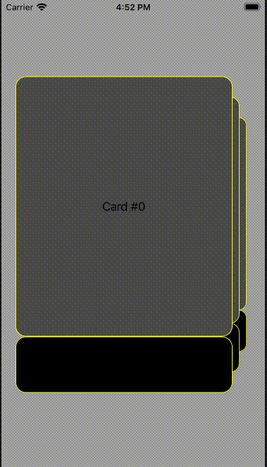

# SwipeableCards

This is a demo project designed to offer a customizable implementation of swipeable cards. It adds convenient functionality such as a UITableView-style dataSource/delegate interface for loading views dynamically, and efficient view loading, unloading.

